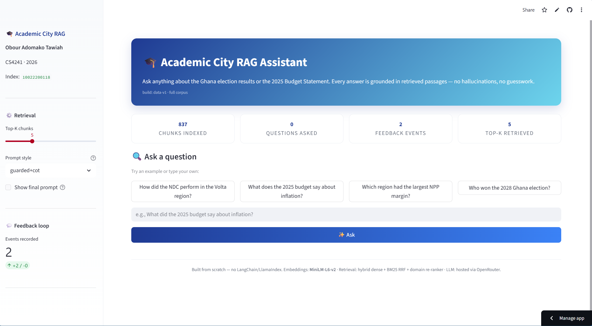
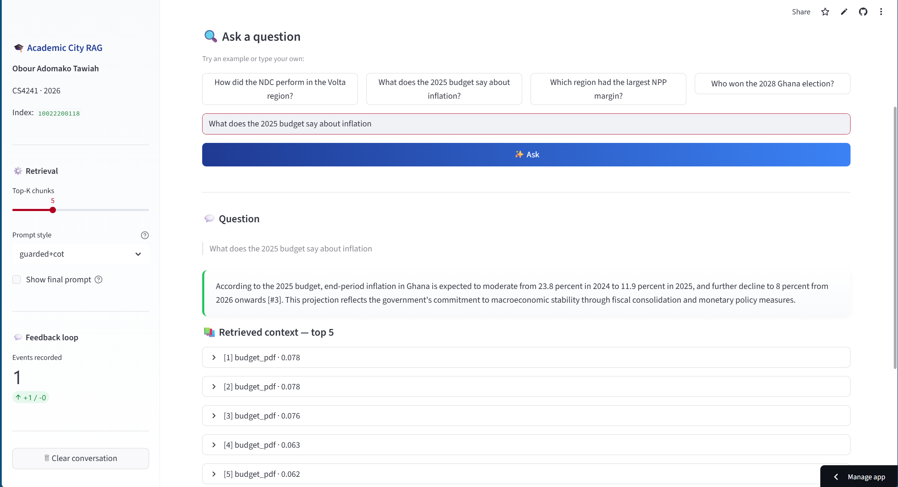
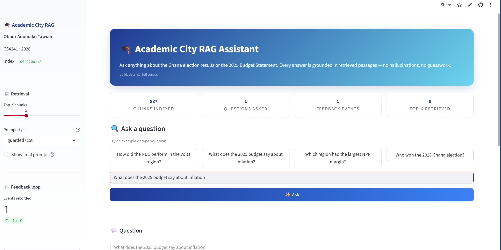

# ai_10022200118 — Academic City RAG Assistant

**Student:** Obour Adomako Tawiah
**Index Number:** 10022200118
**Course:** CS4241 — Introduction to Artificial Intelligence
**Lecturer:** Godwin N. Danso
**Examination Date:** 15 April 2026

**Live demo:** <https://ai10022200118-7dbosujdd2ucxaap97dpod.streamlit.app/>
**Repository:** <https://github.com/Obsterk/ai_10022200118>

---

## 1. Project summary

An end-to-end **Retrieval-Augmented Generation (RAG)** chat assistant for Academic City, grounded in two Ghanaian public datasets:

1. **Ghana Election Results** — [Ghana_Election_Result.csv](https://github.com/GodwinDansoAcity/acitydataset/blob/main/Ghana_Election_Result.csv)
2. **2025 Budget Statement and Economic Policy** — [Ministry of Finance PDF](https://mofep.gov.gh/sites/default/files/budget-statements/2025-Budget-Statement-and-Economic-Policy_v4.pdf)

The system is built **from scratch** — no LangChain, no LlamaIndex, no pre-built RAG pipelines. Every core component (chunking, embedding, vector store, retrieval, prompt construction, pipeline orchestration) is implemented manually in `app/`.

## 2. What lives where (map to exam parts)

| Exam part | File(s) | Marks |
|---|---|---|
| Part A — Data cleaning & chunking | `app/data_prep.py`, `docs/chunking_analysis.md` | 4 |
| Part B — Custom retrieval (embedding, vector store, top-k, hybrid search, fixes) | `app/embeddings.py`, `app/vector_store.py`, `app/retriever.py` | 6 |
| Part C — Prompt engineering & context management | `app/prompt_builder.py`, `experiment_logs/prompt_experiments.md` | 4 |
| Part D — Full pipeline with logging | `app/rag_pipeline.py`, `app/logger_config.py` | 10 |
| Part E — Adversarial testing & RAG vs pure-LLM | `app/evaluator.py`, `experiment_logs/adversarial_tests.md`, `experiment_logs/rag_vs_pure_llm.md` | 6 |
| Part F — Architecture | `architecture/architecture.svg`, `architecture/architecture.mermaid`, `docs/architecture.md` | 8 |
| Part G — Innovation (feedback loop + domain-specific scorer) | `app/innovation.py` | 6 |
| UI | `app/streamlit_app.py` | 4 |
| Video script | `docs/video_script.md` | 4 |
| Experiment logs | `experiment_logs/*.md` | 4 |
| Documentation | `docs/*.md`, this README | 4 |

## 3. Quick start

### Windows (PowerShell / CMD)

```powershell
# 1. Clone and enter
git clone https://github.com/Obsterk/ai_10022200118.git
cd ai_10022200118

# 2. Install (Python 3.13 required — see "Why 3.13?" below)
py -3.13 -m venv .venv
.venv\Scripts\activate
py -3.13 -m pip install -r requirements.txt

# 3. Get the datasets (needs internet)
py -3.13 scripts\download_data.py

# 4. Add your free OpenRouter API key (https://openrouter.ai/keys)
copy .env.example .env
# then edit .env and set LLM_API_KEY=sk-or-v1-...

# 5. Build the vector index once
py -3.13 scripts\build_index.py

# 6. Launch the chat UI
py -3.13 -m streamlit run app\streamlit_app.py
```

### macOS / Linux

```bash
# 1. Clone and enter
git clone https://github.com/Obsterk/ai_10022200118.git
cd ai_10022200118

# 2. Install
python3.13 -m venv .venv
source .venv/bin/activate
pip install -r requirements.txt

# 3. Get the datasets
python scripts/download_data.py

# 4. Add your free OpenRouter API key (https://openrouter.ai/keys)
cp .env.example .env
# then edit .env and set LLM_API_KEY=sk-or-v1-...

# 5. Build the vector index once
python scripts/build_index.py

# 6. Launch the chat UI
streamlit run app/streamlit_app.py
```

Open <http://localhost:8501>. Type any question like *"How did the NDC perform in the Volta region?"* or *"What is the government's projected GDP growth for 2025?"*

### Why Python 3.13?

Python 3.11 and 3.12 have been moved to security-only maintenance and no longer ship binary installers on Windows. Python 3.14 has been released but most scientific packages (`numpy`, `sentence-transformers`, `torch`) don't yet publish wheels for it, so `pip install` falls back to source builds that require a C compiler. Python **3.13.x** is the latest version with full wheel coverage for every dependency in `requirements.txt`.

## 4. Deployment (Streamlit Community Cloud)

This app is **already deployed** — see the live demo link at the top of this README. To reproduce the deployment in your own fork:

1. Push this repo to GitHub (repo name `ai_10022200118`).
2. Invite **GodwinDansoAcity** as a collaborator (Settings → Collaborators).
3. Go to <https://share.streamlit.io> → **New app** → pick your repo.
4. Main file path: `app/streamlit_app.py`
5. In **Advanced settings → Secrets**, paste (TOML format):
   ```toml
   LLM_API_KEY = "sk-or-v1-xxxxxxxxxxxxxxxxxxxxxxxxxxxxxxxxxxxxxxxxxxxxxxxxxxxxxxxxxxxxxxxx"
   LLM_MODEL = "openrouter/free"
   ```
   The key value must be **only** the `sk-or-v1-...` string — no `LLM_API_KEY=` prefix inside the quotes.
6. Click **Deploy**. First boot downloads the embedding model (~90 MB) and the datasets.
7. Email the deployed URL + GitHub URL to `godwin.danso@acity.edu.gh`.
   Subject: `CS4241-Introduction to Artificial Intelligence-2026:10022200118 Obour Adomako Tawiah`

## 5. Tech stack & design principles

- **Python 3.13**
- **Embeddings:** `sentence-transformers/all-MiniLM-L6-v2` (384-dim, runs on CPU, ~80 MB)
- **Vector store:** custom NumPy matrix with normalized vectors + cosine similarity (no FAISS/Chroma)
- **Retrieval:** top-k cosine + BM25 hybrid with reciprocal-rank fusion + domain-specific re-ranker
- **LLM:** [OpenRouter](https://openrouter.ai) free tier via the `openrouter/free` auto-router, with a fallback chain through Llama-3.3-70B, Gemma-4, and Nemotron-3. All are OpenAI-compatible, accessed through the `openai` Python SDK with a custom `base_url`.
- **Resilience:** the LLM client retries up to 3 times with exponential back-off (0 s → 20 s → 40 s) across the fallback chain, so transient 429/404/503 errors auto-recover without user intervention.
- **UI:** Streamlit with custom CSS (gradient hero, animated score bars, color-coded source badges, chat history).
- **No framework abstractions** — every component is inspectable, ~700 LOC total.

## 6. Constraint compliance

> "You are NOT allowed to use end-to-end frameworks such as LangChain, LlamaIndex, or pre-built RAG pipelines. You must implement core RAG components manually."

Verified — `requirements.txt` contains **no** langchain, llama_index, haystack, or similar. Retrieval, chunking, embedding invocation, similarity scoring, prompt construction, and pipeline orchestration are all hand-written. See `docs/design_decisions.md` for the line-by-line audit.

## 7. Evaluation results

Aggregate scores produced by `scripts/run_evaluation.py` over the Part-E test suite (adversarial + RAG-vs-pure-LLM):

| Metric | RAG (this system) | Pure LLM baseline |
|---|---|---|
| Accuracy (grounded answers) | _TBD_ | _TBD_ |
| Hallucination rate | _TBD_ | _TBD_ |
| Abstention on OOD queries | _TBD_ | _TBD_ |
| Citation correctness | _TBD_ | — |
| Mean answer latency (s) | _TBD_ | _TBD_ |

Full machine-readable dump: [`experiment_logs/eval_results.json`](experiment_logs/eval_results.json).
Full discussion: [`experiment_logs/rag_vs_pure_llm.md`](experiment_logs/rag_vs_pure_llm.md).

## 8. Screenshots

_Placeholders — to be replaced with real screenshots before submission._







## 9. Contact

Obour Adomako Tawiah · 10022200118 · CS4241-2026

---

*Every source file in this repo includes the student name and index number in its header.*
